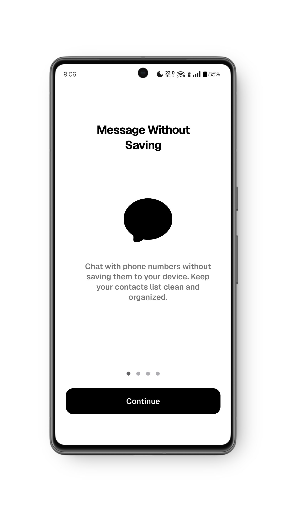
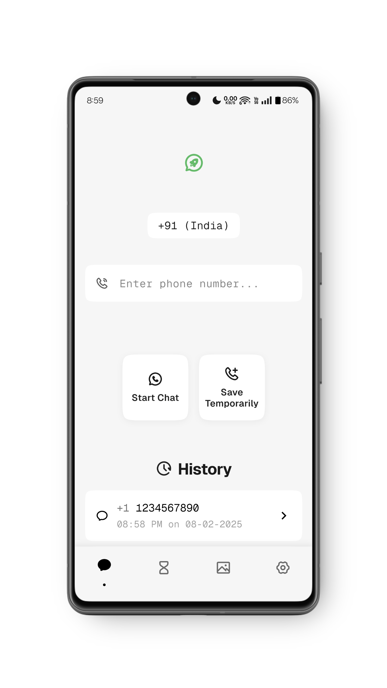
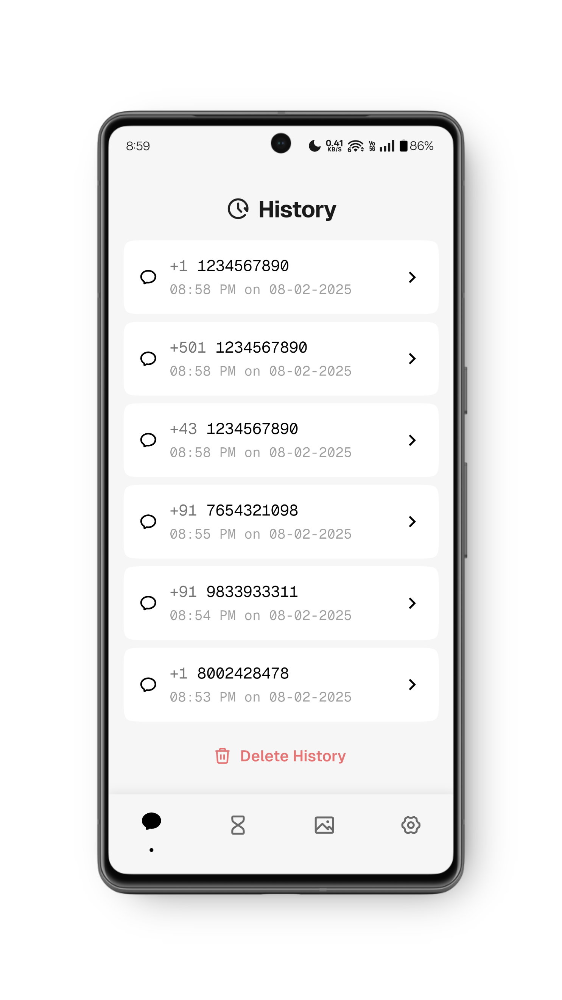
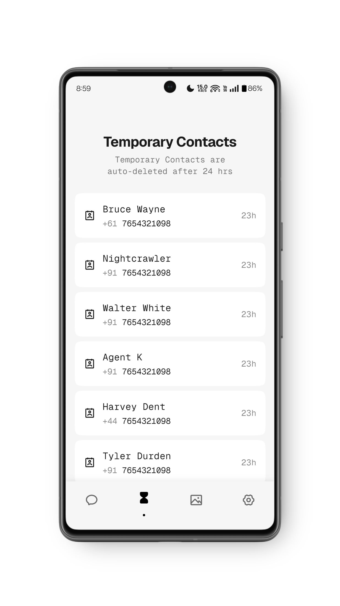
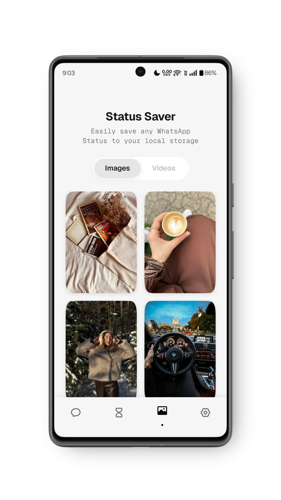
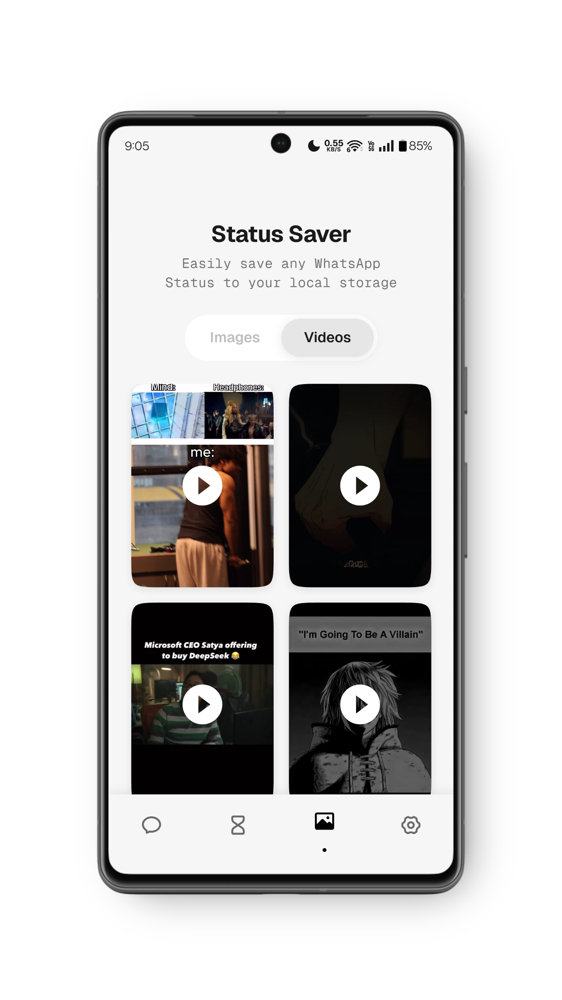
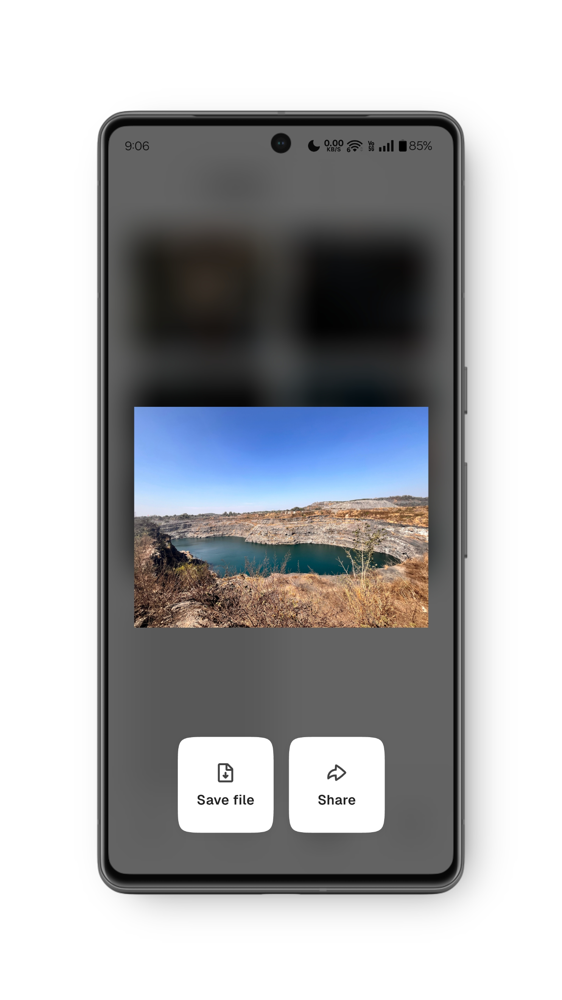
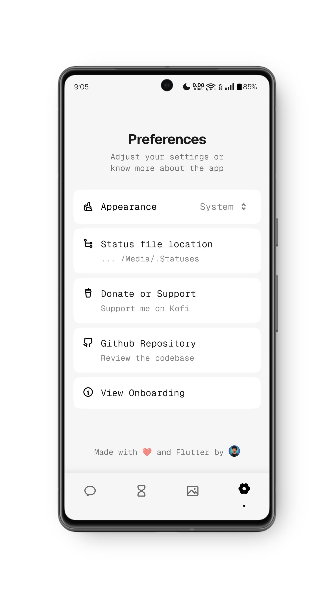
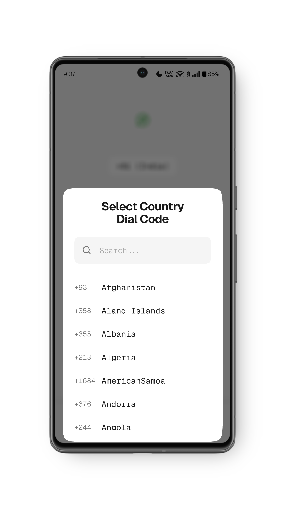

# <div align="center">  WhatsBuddy</div>

<div align="center">WhatsBuddy is a beautiful and minimal WhatsApp utility app that lets you message phone numbers without saving them, add temporary contacts, and save status media files to local storage, built using Flutter.

---


</div>

## 🎬 Video Demo

Watch the demo video to see WhatsBuddy in action:

[](demo/screen-recording-demo.mp4)

---

## ✨ Features

1. **Message without Saving:** Chat with phone numbers without saving them to your device. Keep your contacts list clean and organized.
2. **Temporary Contacts:** Add temporary contacts that are automatically deleted after 24 hours. Perfect for one-time conversations.
3. **Status Saver:** Easily save or share any status image or video you've viewed. Never miss out on important moments.
4. **Beautiful Design:** A thoughtfully designed and optimized user interface that makes navigating through the app a delightful experience.

---

## 📸 App Screenshots

Below is a quick look at what WhatsBuddy has to offer:

| Onboarding Screen | Messaging Screen | Messaging History |
|------------------|------------------|--------------|
|   |   |   |

| Temporary Contacts | Status Saver (images) | Status Saver (videos) |
|-------------|------------|--------------|
|   |   |   |

| Media Viewer | Preferences Screen | Dial Code Selector |
|--------------|--------------|---------------|
|  |  |  |

---

## 📦 Packages & Technologies Used

| Package                      | Purpose                                  | Version     |
|------------------------------|------------------------------------------|-------------|
| **flutter_riverpod**         | State management                         | ^2.3.6      |
| **hive_flutter**             | Local database management with Hive      | ^1.1.0      |
| **url_launcher**             | Deep linking to WhatsApp                 | ^6.1.11     |
| **video_player**             | Playback of status videos                | ^2.8.0      |
| **cupertino_rounded_corners**| Modern UI styling with rounded edges     | ^2.1.1      |
| **shimmer**                  | Loading effects in status saver screens  | ^3.0.0      |
| **flutter_contacts**         | Accessing device contacts                | ^1.1.9+2    |
| **heroine**                  | Seamless page transitions                | ^0.4.0      |

For the complete list, see [pubspec.yaml](pubspec.yaml).

---

## 🚀 Installation

1. **Clone the repository:**  
   ```bash
   git clone https://github.com/DebojyotiChakraborty/WhatsBuddy.git
   ```
2. **Install dependencies:**  
   Navigate to the app directory and run:
   ```bash
   flutter pub get
   ```
3. **Configure Storage Access (Android):**  
   Make sure to grant storage permissions as requested by the app to access WhatsApp statuses.
4. **Run the App:**  
   Execute:
   ```bash
   flutter run
   ```

---

## 🤝 Contributing

Contributions are what make the open-source community such an amazing place to learn, inspire, and create. Any contributions you make are greatly appreciated.

1. **Fork the Project**
2. **Create your Feature Branch** (git checkout -b feature/AmazingFeature)
3. **Commit your Changes** (git commit -m 'Add some AmazingFeature')
4. **Push to the Branch** (git push origin feature/AmazingFeature)
5. **Open a Pull Request**

---
